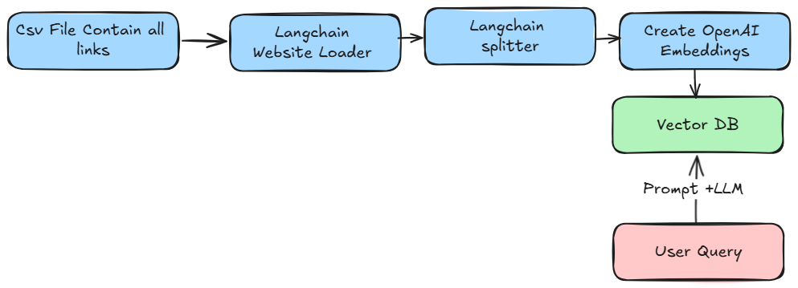

# WebsiteGPT: AI-Powered Website Assistant

WebsiteGPT is an innovative AI-powered web application that revolutionizes how businesses interact with their website content and documentation. By leveraging advanced language models and efficient information retrieval techniques, WebsiteGPT provides instant, accurate answers to user queries about your website or documentation.


Demo Link :- https://youtu.be/5E_Dhtys4ec

## Business Value

- **Enhance Customer Support**: Reduce support ticket volume by providing instant, accurate answers to common questions.
- **Improve User Engagement**: Keep users on your site longer by offering interactive, intelligent assistance.
- **Boost Conversion Rates**: Guide potential customers through your product information more effectively.
- **Reduce Training Costs**: New employees can quickly find answers to their questions about company products or processes.
- **Gain Valuable Insights**: Analyze user queries to understand customer needs and improve your website content.

## Key Features

- **Chat with Your Website**: Similar to ChatGPT, but tailored specifically to your website's content.
- **Real-time Information Retrieval**: Instantly access the most up-to-date information from your live website.
- **Customizable AI Responses**: Train the AI to respond in your brand's voice and style.
- **Multi-lingual Support**: Communicate with users in their preferred language.
- **Analytics Dashboard**: Gain insights into user queries and AI performance.
- **Seamless Integration**: Easily embed WebsiteGPT into your existing website.
- **Scalable Architecture**: Designed to handle high volumes of concurrent users.

## Technical Overview

WebsiteGPT is built on a robust Flask backend, utilizing cutting-edge AI technologies:

- **RAG System**: Employs Retrieval-Augmented Generation for accurate and contextual responses.
- **FAISS Vector Store**: Ensures lightning-fast information retrieval.
- **OpenAI's GPT Model**: Generates human-like, coherent responses.
- **LangChain Integration**: Streamlines the AI workflow for efficient processing.

## Getting Started

### Prerequisites

- Python 3.7+
- OpenAI API access
- FAISS-compatible hardware (CPU or GPU)

### Quick Start

1. Clone the repository:
   ```
   git clone https://github.com/yourusername/websitegpt.git
   cd websitegpt
   ```

2. Install dependencies:
   ```
   pip install -r requirements.txt
   ```

3. Set up your environment variables:
   ```
   cp .env.example .env
   # Edit .env with your API keys and configuration
   ```

4. Run the indexing script to create your website's knowledge base:
   ```
   python data_ingetion.py
   ```

5. Start the WebsiteGPT server:
   ```
   python app.py
   ```

6. Visit `http://localhost:8080` to interact with your WebsiteGPT instance.

## Customization

- **Branding**: Adjust the `templates/index.html` file to match your website's look and feel.
- **AI Behavior**: Modify the system prompt in `app.py` to change how the AI assistant behaves and responds.
- **Indexing**: Customize `index_website.py` to focus on specific parts of your website or to include additional data sources.
